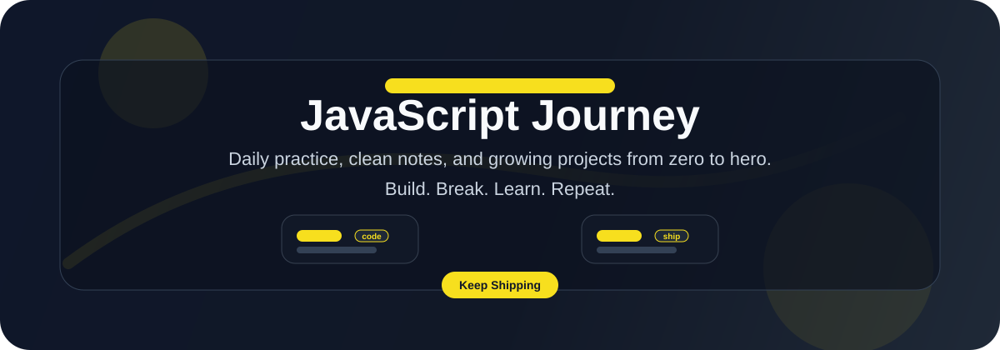

<div align="center">


# JavaScript Journey

<p><strong>Zero to hero, one day at a time.</strong></p>



</div>

This repository is my public log of learning JavaScript from zero to confidence. It holds daily practice, experiments, mini-projects, and notes as I grow.

## What this repo contains

- Daily learning folders
- Small practice programs
- Notes on syntax, logic, and core concepts
- Future mini-projects and API experiments

## Learning path

| Day | Folder | Focus |
| --- | --- | --- |
| 0 | [Day-0](./Day-0) | Basics, variables, loops, conditions, functions, operators |
| 1 | [Day-1](./Day-1) | Practice and early JavaScript exercises |

More days will be added as the journey continues.

## Current workflow

I use a small helper script to publish progress to GitHub.

```bash
node publish.js
```

The script asks what you worked on, builds a commit message, adds your changes, commits them, and pushes to GitHub.

## How to run code

Most files can be executed with Node.js:

```bash
node Day-0/basic.js
```

## Goals

- Build a strong JavaScript foundation
- Learn DOM, events, and browser APIs
- Practice ES6+ syntax and patterns
- Understand async JavaScript and promises
- Create small but useful projects

## Tech stack

- JavaScript
- Node.js
- HTML and CSS for browser-based practice

## Progress mindset

Small daily progress beats random big effort. This repo is about consistency, not perfection.
